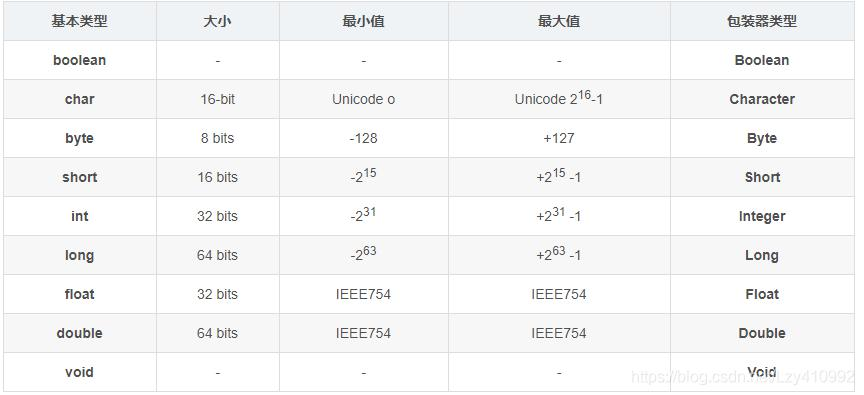

# 数据类型


```
package com.thomas;

import java.sql.Array;
import java.util.List;

/**
 * @Author: Thomas
 * @Description:
 * @Date: Created in 21:57 2022/4/27
 * @Modified By:
 */


public class Thomas_0427 {

    static byte b;

    static short s;

    static int i;

    static long l;

    static float f;

    static double d;

    static char c;

    static boolean bo;

    public static void main(String[] args) {

        System.out.println("byte的大小：" + Byte.SIZE

                + ";默认值：" + b

                + ";数据范围：" + Byte.MIN_VALUE + " - " + Byte.MAX_VALUE);


        System.out.println("short的大小：" + Short.SIZE

                + ";默认值：" + s

                + ";数据范围：" + Short.MIN_VALUE + " - " + Short.MAX_VALUE);


        System.out.println("int的大小：" + Integer.SIZE

                + ";默认值：" + i

                + ";数据范围：" + Integer.MIN_VALUE + " - " + Integer.MAX_VALUE);


        System.out.println("long的大小：" + Long.SIZE

                + ";默认值：" + l

                + ";数据范围：" + Long.MIN_VALUE + " - " + Long.MAX_VALUE);


        System.out.println("float的大小：" + Float.SIZE

                + ";默认值：" + f

                + ";数据范围：" + Float.MIN_VALUE + " - " + Float.MAX_VALUE);


        System.out.println("double的大小：" + Double.SIZE

                + ";默认值：" + d

                + ";数据范围：" + Double.MIN_VALUE + " - " + Double.MAX_VALUE);


        System.out.println("char的大小：" + Character.SIZE

                + ";默认值：" + c

                + ";数据范围：" + Character.MIN_VALUE + " - " + Character.MAX_VALUE);


        System.out.println("boolean的大小：" + Byte.SIZE

                + ";默认值：" + bo

                + ";数据范围：" + Byte.MIN_VALUE + " - " + Byte.MAX_VALUE);
    }
}
```
